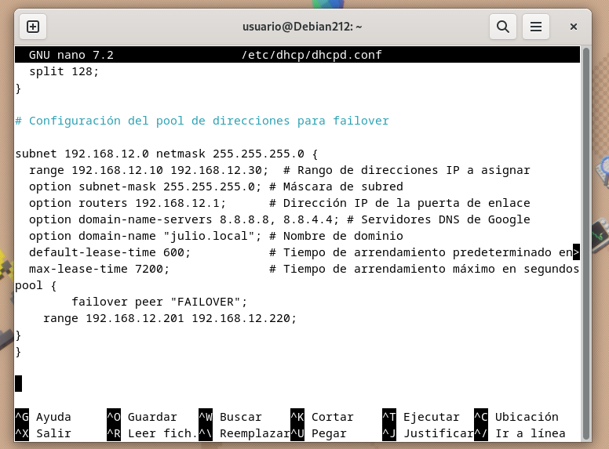
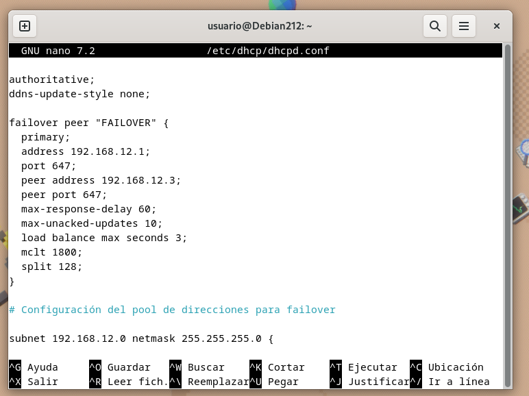

## Archivos de configuracion
Archivo de Configuración del Servidor DHCP (ISC DHCP):

Ruta del archivo: /etc/dhcp/dhcpd.conf
Descripción: Este archivo contiene la configuración del servidor DHCP. Puedes definir los rangos de direcciones IP, las opciones de configuración, las directivas de failover y otros parámetros relacionados con la asignación dinámica de direcciones IP.

Archivo de Configuración de Failover DHCP (ISC DHCP):

Ruta del archivo: /etc/dhcp/dhcpd.conf (en el mismo archivo que el servidor DHCP principal y secundario)
Descripción: En el mismo archivo de configuración del servidor DHCP, puedes definir las directivas de failover. Estas directivas se utilizan para configurar la relación de failover entre el servidor principal y el secundario.

