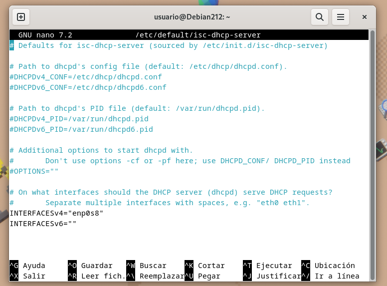
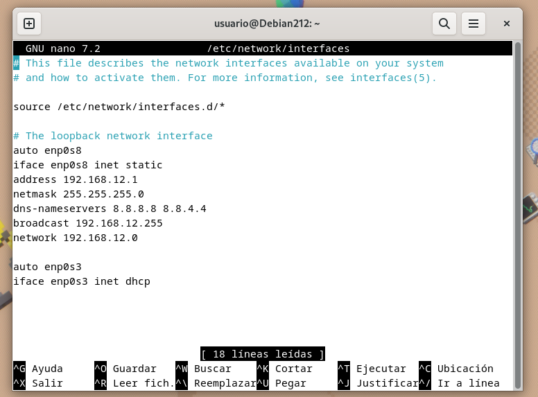

# Interfaces
Primeramente tendremos que tener dos tarjetas de red una que sera para recibir internet y la otra tarjeta seria el servidor donde daria el servicio DHCP, la red enp0s3 la dejamos como dinamica, luego la otra red la configuramos como servidor y la ponemos estatica 

